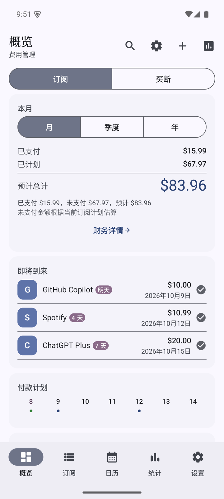
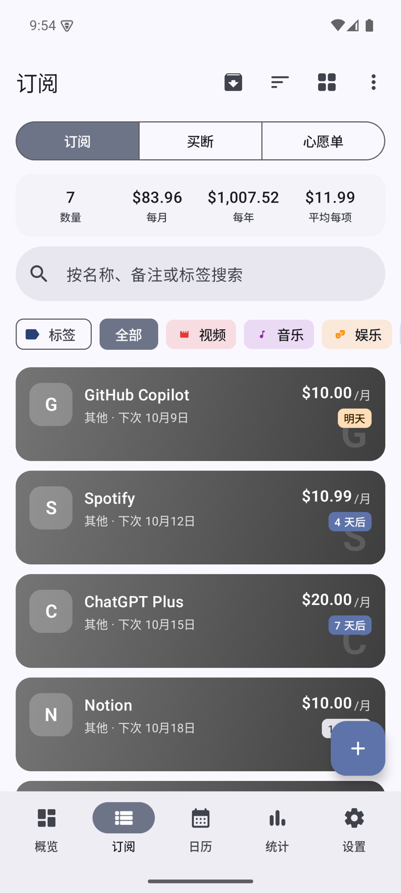
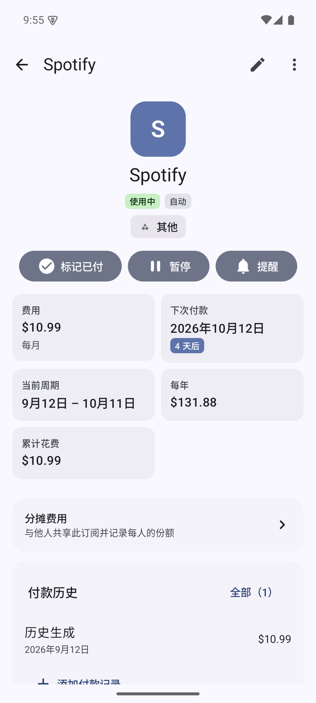
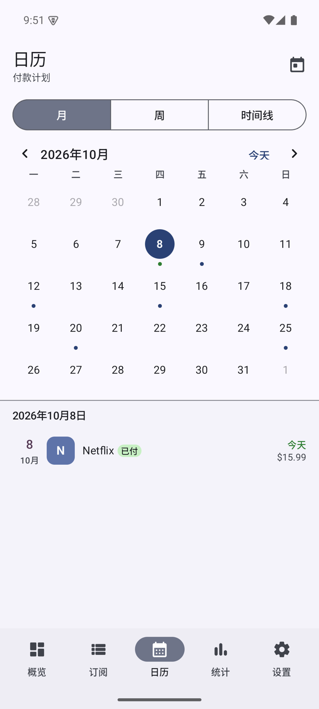
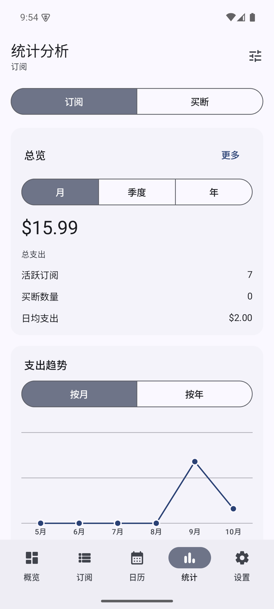

<div align="center">

# SubMark

**开源、离线优先的 Android 订阅与支出管理应用**

记下每一笔订阅和买断，看清每月真正花了多少钱。

[](https://github.com/exynos967/SubMark/releases)
[](https://github.com/exynos967/SubMark/actions/workflows/release.yml)
[](LICENSE)


[功能](#-功能) · [下载](#-下载) · [构建](#-从源码构建) · [技术栈](#-技术栈) · [English](#english)

</div>

## 📱 截图

<table>
  <tr>
    <td align="center"><br><sub>概览</sub></td>
    <td align="center"><br><sub>订阅列表</sub></td>
    <td align="center"><br><sub>订阅详情</sub></td>
    <td align="center"><br><sub>日历</sub></td>
    <td align="center"><br><sub>统计</sub></td>
  </tr>
</table>

---

## ✨ 功能

### 📋 订阅管理

| | |
|---|---|
| **四种类型** | 周期订阅、储值（充值卡 / 余额类）、买断、愿望单 |
| **灵活周期** | 周 / 月 / 季 / 半年 / 年，以及任意天数、周数、月数、年数的自定义周期 |
| **续费方式** | 自动续费、手动续费、免费试用（试用结束时提醒你转为续费或取消） |
| **整理** | 分类、标签、文件夹、自定义字段，支持归档已停用的订阅 |
| **套餐与分摊** | 主订阅 + 子订阅的套餐结构；和他人合租时记录每个人的分摊 |
| **图标** | 内置图标库、Emoji、网站图标自动抓取、图标包仓库、本地图片 |

### 💰 支出与账务

- **付款记录**：自动按周期记账，也可以手动标记已付、补录历史付款
- **钱包**：记录银行账户、信用额度或现金，订阅关联钱包后能看到余额还能撑多久
- **多币种**：每个订阅可用不同币种，自动换算为默认货币，可查看历史汇率
- **预算**：设置年度预算，概览页实时显示使用进度
- **财务详情**：按月 / 季度 / 年查看已付、待付和预计总额

### 📊 概览、日历与统计

- **概览**：本期支出、即将到来、未来 7 天付款计划、最近付款、钱包余额，模块可自由排序和开关；订阅与买断分开统计
- **日历**：月视图 / 周视图 / 时间线三种模式，左右滑动翻页，彩色圆点标记付款日
- **统计**：支出趋势、付款热力图、分类占比、多维度雷达图、储值卡统计
- **全局搜索**：按名称、备注、标签查找任何订阅

### 🔔 提醒与小组件

- 付款前提醒，可设置提前天数和提醒时间；重启手机后自动恢复提醒
- 自带通知诊断页，排查收不到提醒的原因
- 桌面小组件：**即将到来**、**支出汇总**

### 🔗 扩展集成

| 集成 | 用途 |
|---|---|
| **AI 识别** | 从应用商店或价格页截图中识别订阅信息，支持 OpenAI、通义千问及任意 OpenAI 兼容接口 |
| **App Store / RAWG 搜索** | 搜索应用和游戏，自动填充名称、图标和价格 |
| **热门订阅库** | 从可自定义的订阅模板仓库一键添加常见服务 |
| **价格监控** | 跟踪愿望单商品的价格变化 |
| **面板** | 查看 API 额度余额（DeepSeek、PackyCode、New API / V-API、Z.ai）和服务状态（Clash 订阅流量、Emby） |

### 🎨 分享、备份与个性化

- **分享**：生成订阅海报（极简 / 现代 / 渐变 / 多彩四种风格）、自选时间段的财务报告海报，二维码分享与导入订阅
- **备份**：本地备份与 WebDAV 云备份，支持定时自动备份
- **隐私**：数据只存在本机，无账号、无追踪；支持密码锁与生物识别解锁
- **外观**：浅色 / 深色 / 跟随系统主题、Material You 壁纸取色、多彩模式、字体与应用图标切换
- **语言**：简体中文、English
- **动效**：Material 3 页面过渡与预见式返回手势

---

## 📥 下载

前往 [Releases](https://github.com/exynos967/SubMark/releases) 下载最新版本，按手机架构选择 APK：

| 文件 | 适用设备 |
|---|---|
| `SubMark-<版本>-arm64-v8a.apk` | **绝大多数现代手机**（不确定就选这个） |
| `SubMark-<版本>-armeabi-v7a.apk` | 较老的 32 位 ARM 手机 |
| `SubMark-<版本>-x86_64.apk` | x86 模拟器、部分平板与 Chromebook |

> 需要 Android 10 及以上。所有版本使用同一签名，可直接覆盖升级。每次发版附带 `SHA256SUMS.txt` 供校验。

---

## 🛠 从源码构建

**环境**：JDK 17、Android SDK 35

```bash
git clone https://github.com/exynos967/SubMark.git
cd SubMark

./gradlew :app:assembleDebug        # 调试版
./gradlew testDebugUnitTest         # 运行单元测试
./gradlew :app:assembleRelease      # 发布版（按 ABI 拆分为三个 APK）
```

**发布版签名**：通过环境变量或项目根目录的 `keystore.properties`（已被 git 忽略）提供密钥；两者都没有时回退到调试密钥，方便本地测试。

| 环境变量 | `keystore.properties` 键 |
|---|---|
| `SUBMARK_KEYSTORE_FILE` | `storeFile` |
| `SUBMARK_KEYSTORE_PASSWORD` | `storePassword` |
| `SUBMARK_KEY_ALIAS` | `keyAlias` |
| `SUBMARK_KEY_PASSWORD` | `keyPassword` |

**自动发版**：[Release 工作流](.github/workflows/release.yml) 会构建三个架构的签名 APK 并附加到 GitHub Release，两种方式任选：

1. **在 Actions 页面手动运行**：Actions → Release → Run workflow，填写版本号（如 `0.1.0`），会自动创建 `v0.1.0` 标签和 Release；留空则只构建、产物在运行记录里下载
2. **在 GitHub 网页发布 Release**：新建 Release 并以版本号作标签（如 `v0.1.0`），发布后自动构建并把 APK 附加上去

版本号带 `-`（如 `0.2.0-beta.1`）时标记为预发布。

---

## 🧱 技术栈

- **语言 / UI**：Kotlin、Jetpack Compose、Material 3
- **架构**：多模块（`core:*` + `feature:*`），MVVM + 单向数据流
- **依赖注入**：Hilt
- **存储**：Room、DataStore（kotlinx.serialization）
- **导航**：Navigation Compose 类型安全路由
- **后台任务**：WorkManager（提醒、小组件刷新、自动备份）
- **小组件**：Jetpack Glance

```
app                 应用入口、导航与动效
core/
  model             实体与枚举
  domain            日期与金额计算
  database          Room 数据库
  data              仓库、服务、设置
  ui                主题、通用组件、图表
feature/
  subscriptions     订阅列表、详情、编辑、分类/标签/字段管理
  money             付款、钱包、货币、预算、储值
  overview          概览与全局搜索
  calendar          日历
  analytics         统计
  share             海报、报告、二维码
  notifications     提醒
  backup            本地与 WebDAV 备份
  settings          设置、外观、安全、引导
  integrations      AI、搜索、热门库、价格监控、面板
  widget            桌面小组件
```

---

## 📄 许可证

SubMark 以 [GNU Affero General Public License v3.0](LICENSE) 发布。

---

## English

**SubMark** is an open-source, offline-first subscription and expense tracker for Android. Track recurring subscriptions, stored-value plans, lifetime purchases and wishlist items; see what you really spend per month and year; get reminders before each payment; and view everything in an overview, calendar and analytics dashboard. Data stays on your device, with optional local and WebDAV backups.

Download the APK for your device's architecture from [Releases](https://github.com/exynos967/SubMark/releases) (most phones: `arm64-v8a`). Requires Android 10+. Licensed under [AGPL-3.0](LICENSE).
